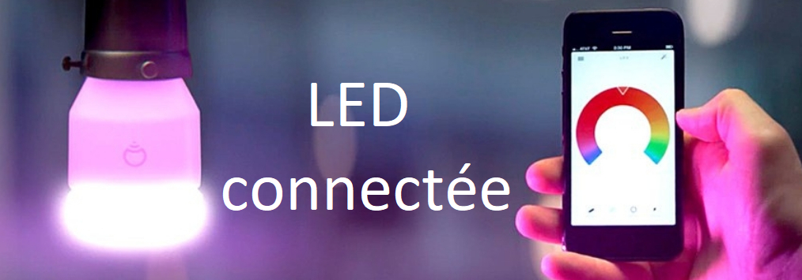

<h1 align="center">
  
</h1>

---

# LAMPE CONNECTEE

## Petit résumé
  - Au fil des décennies, les techniques d'éclairages ont faient des progrès considérables: verre dépoli, utilisation de gaz inertes, fibre en tungstène, néon, led. L'efficacité lumineuse a été augmentée et la durée de vie prolongée. Il est désormais possible de contrôler son ampoule par smartphone.

## Objectif
- Créer une application mobile pour contrôler une ampoule connectée.

## Techno
- Java
- Android Studio

## UML

## UI

## Auteur
- [@Pierre](https://github.com/Pierre-Portfolio)
